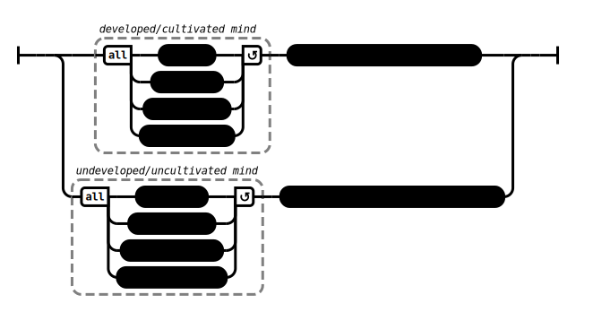

# A Single Thing (AN 1:21–30, 39–40)

## Causation Model(s)

### Quote(s):
> The mind, when undeveloped, leads to great harm
>
> The mind, when developed, leads to great benefit
>
> The mind—when untamed, unguarded, unprotected, unrestrained—leads to great harm
>
> The mind—when tamed, guarded, protected, restrained—leads to great benefit

Figure 1: The developed/undevelopment mind causation model

## Source
1. https://www.dhammatalks.org/suttas/AN/AN1_21.html
