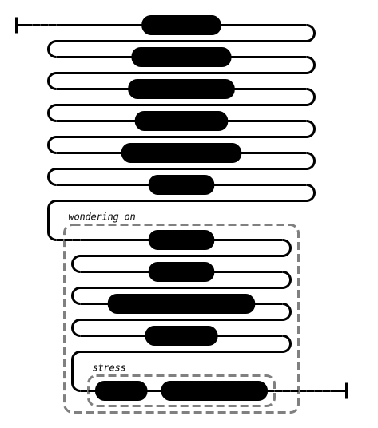

# Foul-smelling (AN 1:329)

## _[Speculative]_ Causation Model(s)

### Quote(s):
> * Just as even a tiny amount of feces is foul-smelling, in the same way, I don’t praise even a tiny amount of becoming

Figure 1: Wondering on causation-model

## Source
1. https://www.dhammatalks.org/suttas/AN/AN1_329.html