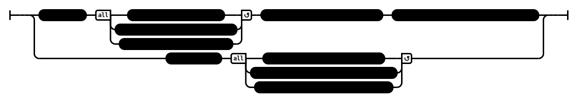

# A Pool of Water (AN 1:45–46)

## Causation Model(s)

### Quote(s):
> * A monk with a sullied mind would know his own benefit, the benefit of others, the benefit of both; that he would realize a superior human state, a truly noble distinction of knowledge & vision: Such a thing is impossible. Why is that? Because of the sullied nature of his mind
> * A monk with an unsullied mind would know his own benefit, the benefit of others, the benefit of both; that he would realize a superior human state, a truly noble distinction of knowledge & vision: Such a thing is possible. Why is that? Because of the unsullied nature of his mind.

Figure 1: Pure/Impure mind causation-model

## Source
1. https://www.dhammatalks.org/suttas/AN/AN1_45.html