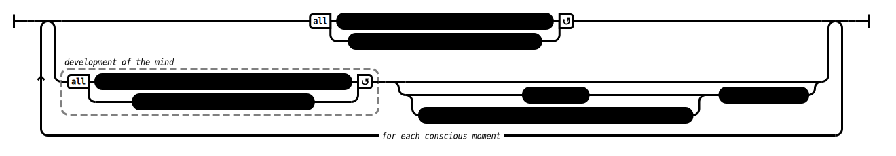

# Luminous (AN 1:50–53)

## _[Speculative]_ Causation Model(s)

### Quote(s):
> * Luminous, monks, is the mind. And it is defiled by incoming defilements. The uninstructed run-of-the-mill person doesn’t discern that as it has come to be, which is why I tell you that—for the uninstructed run-of-the-mill person—there is no development of the mind.
> * Luminous, monks, is the mind. And it is freed from incoming defilements. The well-instructed disciple of the noble ones discerns that as it has come to be, which is why I tell you that—for the well-instructed disciple of the noble ones—there is development of the mind.

Figure 1: Luminous mind causation model

## Source
1. https://www.dhammatalks.org/suttas/AN/AN1_50.html