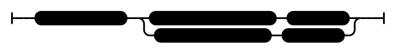

# Voice (AN 2:123–124)

## Causation Model(s)

### Quote(s):
> There are these two conditions for the arising of wrong view. Which two? 
>   1. The voice of another and 
>   2. Inappropriate attention
>
>  There are these two conditions for the arising of right view. Which two? 
>   1. The voice of another and 
>   2. Appropriate attention

Figure 1: Right view causation model

## Source
1. https://www.dhammatalks.org/suttas/AN/AN2_123.html