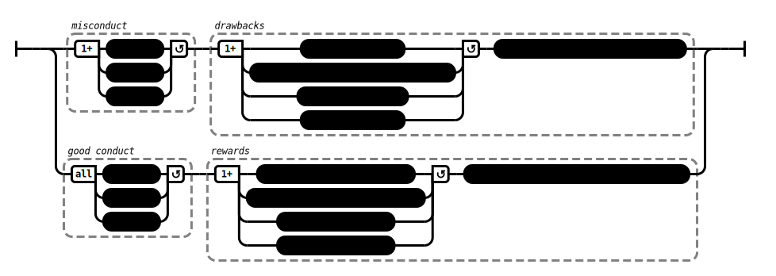

# Categorically (AN 2:18)

## Causation Model(s)

### Quote(s):
> * Bodily misconduct, verbal misconduct, & mental misconduct should not be done
>   * These are the drawbacks one can expect when doing what should not be done: 
>     1. One can fault oneself; 
>     2. observant people, on close examination, criticize one; 
>     3. one’s bad reputation gets spread about; 
>     4. one dies confused; and—on the break-up of the body, after death—one reappears in a plane of deprivation, a bad destination, a lower realm, hell
>
> * Bodily conduct, good verbal conduct, & good mental conduct should be done.
>     * These are the rewards one can expect when doing what should be done: 
>       1. One doesn’t fault oneself; 
>       2. observant people, on close examination, praise one; 
>       3. one’s good reputation gets spread about; 
>       4. one dies unconfused; and—on the break-up of the body, after death—one reappears in a good destination, a heavenly world

Figure 1: Conduct & misconduct causation model

## Source
1. https://www.dhammatalks.org/suttas/AN/AN2_18.html