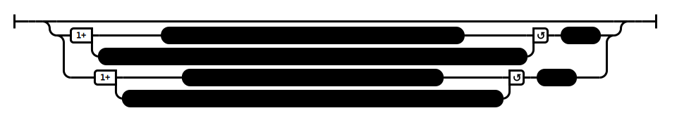

# Fools & Wise People (AN 2:21)

## Causation Model(s)

### Quote(s):
> * These two are fools. Which two? 
>     1. The one who doesn’t see his transgression as a transgression, and 
>     2. the one who doesn’t rightfully pardon another who has confessed his transgression
>
> * These two are wise people. Which two? 
>     1. The one who sees his transgression as a transgression, and 
>     2. the one who rightfully pardons another who has confessed his transgression

Figure 1: Fools & wise people causation model

## Source
1. https://www.dhammatalks.org/suttas/AN/AN2_21.html