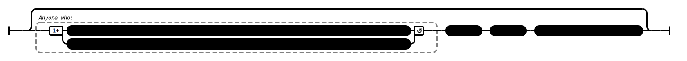

# What Was Not Said (AN 2:23)

## _[Speculative]_ Causation Model(s)

### Quote(s):
> * These two slander the Tathagata. Which two? 
  >   1. He who explains what was not said or spoken by the Tathagata as said or spoken by the Tathagata. And 
  >   2. he who explains what was said or spoken by the Tathagata as not said or spoken by the Tathagata

Figure 1: Slander via spoken words causation model

## Source
1. https://www.dhammatalks.org/suttas/AN/AN2_23.html