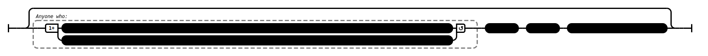

# A Meaning to be Inferred (AN 2:24)

## _[Speculative]_ Causation Model(s)

### Quote(s):
> * These two slander the Tathagata. Which two? 
>   1. He who explains a discourse whose meaning needs to be inferred as one whose meaning has already been fully drawn out. And 
>   2. he who explains a discourse whose meaning has already been fully drawn out as one whose meaning needs to be inferred

Figure 1: Slander via meaning causation model

## Source
1. https://www.dhammatalks.org/suttas/AN/AN2_24.html