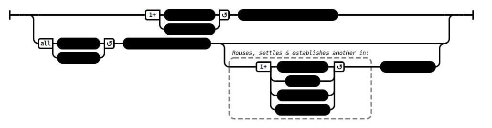

# Gratitude (AN 2:31–32)

## Causation Model(s)

### Quote(s):
> * A person of no integrity is:
>   1.  ungrateful & 
>   2. unthankful
>
> * A person of integrity is:
>   1. grateful & 
>   2. thankful.
>
> * I tell you, monks, there are two people who are not easy to repay. Which two?
>   1. Your mother & 
>   2. father
>
>> * But anyone who: 
>>   1. rouses his unbelieving mother & father, settles & establishes them in conviction; 
>>   2. rouses his unvirtuous mother & father, settles & establishes them in virtue; 
>>   3. rouses his stingy mother & father, settles & establishes them in generosity; 
>>   4. rouses his foolish mother & father, settles & establishes them in discernment
>> 
>>   To this extent one pays & repays one’s mother & father.

Figure 1: Gratitude causation model

## Source
1. https://www.dhammatalks.org/suttas/AN/AN2_30.html