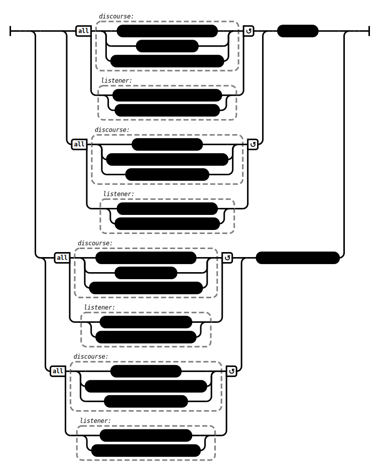

# Bombast (AN 2:46)

## Causation Model(s)

### Quote(s):
> 1. There is the case where in any assembly when the discourses of the Tathagata—
>     * deep, deep in their meaning, transcendent, connected with emptiness—are recited, 
>       * the monks don’t listen, don’t lend ear, don’t set their hearts on knowing them, don’t regard them as worth grasping or mastering. 
>     * But when discourses that are literary works—the works of poets, artful in sound, artful in expression, the work of outsiders, words of disciples—are recited, 
>       * they listen, they lend ear, they set their hearts on knowing them, they regard them as worth grasping & mastering. 
>     * Yet when they have mastered that Dhamma, they don’t cross-question one another about it, don’t dissect: ‘How is this? What is the meaning of this?’ They don’t make open what isn’t open, don’t make plain what isn’t plain, don’t dispel doubt on its various doubtful points
>       * This is called an assembly trained in bombast, not in cross-questioning
>
> 2. There is the case where in any assembly when discourses that are literary works—
>     * the works of poets, artful in sound, artful in rhetoric, the work of outsiders, words of disciples—are recited, 
>       * the monks don’t listen, don’t lend ear, don’t set their hearts on knowing them; don’t regard them as worth grasping or mastering. 
>     * But when the discourses of the Tathagata—deep, deep in their meaning, transcendent, connected with emptiness—are recited, 
>       * they listen, they lend ear, they set their hearts on knowing them, they regard them as worth grasping & mastering. 
>     * And when they have mastered that Dhamma, they cross-question one another about it and dissect it: ‘How is this? What is the meaning of this?’ They make open what isn’t open, make plain what isn’t plain, dispel doubt on its various doubtful points. 
>       * This is called an assembly trained in cross-questioning and not in bombast

Figure 1: Bombast & cross-questioning causation model

## Source
1. https://www.dhammatalks.org/suttas/AN/AN2_46.html