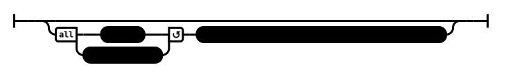

# Guardians of the World (AN 2:9)

## Causation Model(s)

### Quote(s):
> * These two bright qualities guard the world. Which two? 
>   1. Shame & 
>   2. Compunction
>
> * But because these two bright qualities guard the world, there is recognition of 
>   * ‘mother,’ 
>   * ‘mother’s sister,’ 
>   * ‘uncle’s wife,’ 
>   * ‘teacher’s wife,’ & 
>   * ‘wives of those who deserve respect

Figure 1: Shame & compunction causation model

## Source
1. https://www.dhammatalks.org/suttas/AN/AN2_9.html