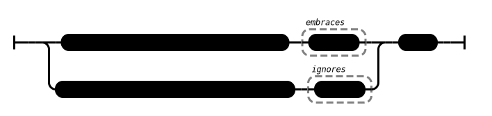

# Fools (AN 2:99)

## Causation Model(s)

### Quote(s):
> These two are fools. Which two? 
>   1. The one who takes up a burden that hasn’t fallen to him, and 
>   2. the one who doesn’t take up a burden that has

Figure 1: Fools causation model

## Source
1. https://www.dhammatalks.org/suttas/AN/AN2_99.html