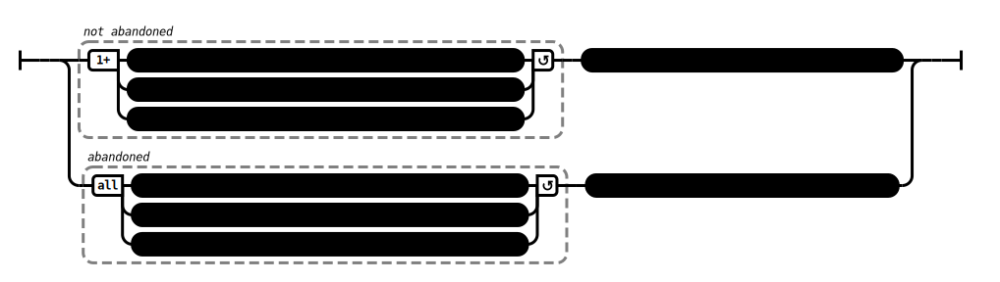

# The Chariot Maker (AN 3:15)

## Causation Model(s)

### Quote(s):
> Any monk or nun in whom 
>   1. the crookedness, faults, & flaws of bodily action are not abandoned; 
>   2. the crookedness, faults, & flaws of verbal action are not abandoned; 
>   3. the crookedness, faults, & flaws of mental action are not abandoned 
> *   has fallen away from this Dhamma & Vinaya
>
> Any monk or nun in whom
>   1. the crookedness, faults, & flaws of bodily action are abandoned; 
>   2. the crookedness, faults, & flaws of verbal action are abandoned; 
>   3. the crookedness, faults, & flaws of mental action are abandoned 
> * stands firm in this Dhamma & Vinaya

Figure 1: Standing firm causation model

## Source
1. https://www.dhammatalks.org/suttas/AN/AN3_15.html