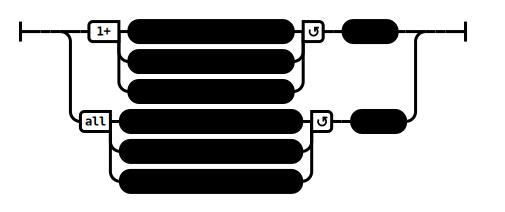

# Characterized (by Action) (AN 3:2)

## Causation Model(s)

### Quote(s):
> A person endowed with three things is to be recognized as a fool. Which three? 
>   1. Bodily misconduct, 
>   2. Verbal misconduct, 
>   3. Mental misconduct
>
> A person endowed with three things is to be recognized as a wise person. Which three? 
>   1. Good bodily conduct, 
>   2. Good verbal conduct, 
>   3. Good mental conduct

Figure 1: Characterised by action causation model

## Source
1. https://www.dhammatalks.org/suttas/AN/AN3_2.html