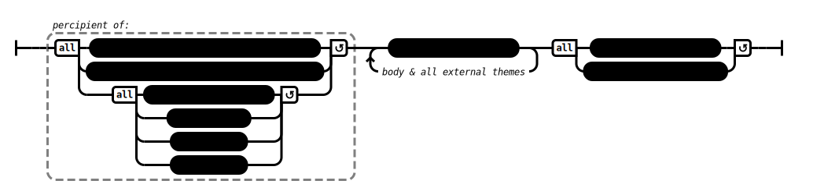

# To Ven. Ananda (AN 3:32)

## Causation Model(s)

### Quote(s):
> There is the case, Ananda, where a monk is percipient in this way: 
>   * 'This is peace, this is exquisite—
>     1. the pacification of all fabrications; 
>     2. the relinquishing of all acquisitions; 
>     3. the ending of craving; dispassion; cessation; unbinding.' 
>
> This is how a monk would have a concentration-attainment of a such a sort, 
>   * that with regard to this conscious body, he would have no I-making or mine-making conceit-obsession, 
>   * that with regard to all external themes [topics of concentration] he would have no I-making or mine-making conceit-obsession, and 
>   * that he would enter & remain in the awareness-release & discernment-release in which there is no I-making or mine-making conceit-obsession for one entering & remaining in it

Figure 1: Conceit obsession causation model

## Source
1. https://www.dhammatalks.org/suttas/AN/AN3_22.html