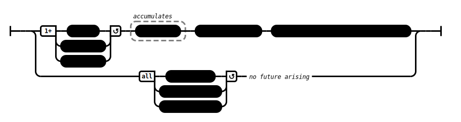

# Causes (AN 3:34)

## Causation Model(s)

### Quote(s):
> Three are causes for the origination of actions. Which three? 
> 1. Greed is a cause for the origination of actions. 
> 2. Aversion is a cause for the origination of actions. 
> 3. Delusion is a cause for the origination of actions
>
> * Any action performed with greed—born of greed, caused by greed, originating from greed: 
>   * Wherever one’s selfhood [atta-bhava] turns up, there that action will ripen. 
>   * Where that action ripens, there one will experience its fruit, either in this very life that has arisen or further along in the sequence.
>
> * Any action performed with aversion—born of aversion, caused by aversion, originating from aversion: 
>   * Wherever one’s selfhood turns up, there that action will ripen. 
>   * Where that action ripens, there one will experience its fruit, either in this very life that has arisen or further along in the sequence.
>
> * Any action performed with delusion—born of delusion, caused by delusion, originating from delusion: 
>   * Wherever one’s selfhood turns up, there that action will ripen. 
>   * Where that action ripens, there one will experience its fruit, either in this very life that has arisen or further along in the sequence
>
> These three are (further) causes for the origination of actions. Which three? 
> 1. Non-greed is a cause for the origination of actions. 
> 2. Non-aversion is a cause for the origination of actions. 
> 3. Non-delusion is a cause for the origination of actions
>
> * Any action performed with non-greed—born of non-greed, caused by non-greed, originating from non-greed: 
>   * When greed is gone, 
>     * that action is thus abandoned, its root destroyed, made like a palmyra stump, deprived of the conditions of development, not destined for future arising
>
> * Any action performed with non-aversion—born of non-aversion, caused by non-aversion, originating from non-aversion: 
>   * When aversion is gone, 
>     * that action is thus abandoned, its root destroyed, made like a palmyra stump, deprived of the conditions of development, not destined for future arising
>
> * Any action performed with non-delusion—born of non-delusion, caused by non-delusion, originating from non-delusion: 
>   * When delusion is gone, 
>     * that action is thus abandoned, its root destroyed, made like a palmyra stump, deprived of the conditions of development, not destined for future arising

Figure 1: Actions causation model

## Source
1. https://www.dhammatalks.org/suttas/AN/AN3_34.html