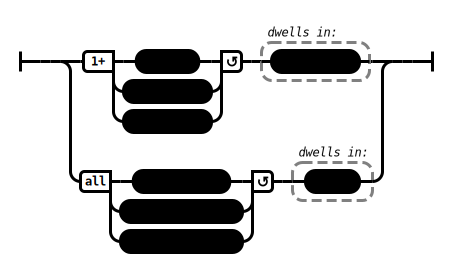

# To Hatthaka (AN 3:35)

## Causation Model(s)

### Quote(s):
> 1. As for those passion-born fevers—
>     * burned with which the householder or householder’s son would sleep miserably—
>     * that passion has been abandoned by the Tathagata, its root destroyed, made like a palmyra stump, deprived of the conditions of development, not destined for future arising. Therefore he sleeps in ease
>
> 2. As for those aversion-born fevers—
>     * burned with which the householder or householder’s son would sleep miserably—
>     * that aversion has been abandoned by the Tathagata, its root destroyed, made like a palmyra stump, deprived of the conditions of development, not destined for future arising. Therefore he sleeps in ease
>
> 3. As for those delusion-born fevers—
>     * burned with which the householder or householder’s son would sleep miserably—
>     * that delusion has been abandoned by the Tathagata, its root destroyed, made like a palmyra stump, deprived of the conditions of development, not destined for future arising. Therefore he sleeps in ease

Figure 1: Ease causation model

## Source
1. https://www.dhammatalks.org/suttas/AN/AN3_35.html