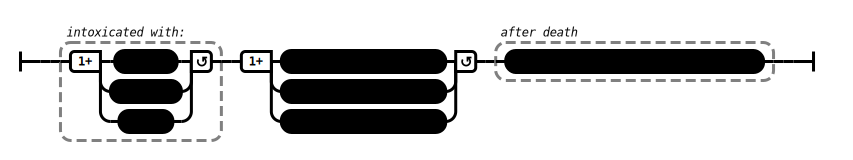

# Refinement (AN 3:39)

## Causation Model(s)

### Quote(s):
> There are these three forms of intoxication. Which three? 
> 1. Intoxication with youth, 
> 2. Intoxication with health, 
> 3. Intoxication with life.
> 
> * Drunk with the intoxication of youth, an uninstructed, run-of-the-mill person engages in bodily misconduct, verbal misconduct, & mental misconduct. 
>     * Having engaged in bodily misconduct, verbal misconduct, & mental misconduct, he—on the break-up of the body, after death—reappears in the plane of deprivation, the bad destination, the lower realms, in hell.
> * Drunk with the intoxication of health, an uninstructed, run-of-the-mill person engages in bodily misconduct, verbal misconduct, & mental misconduct. 
>     * Having engaged in bodily misconduct, verbal misconduct, & mental misconduct, he—on the break-up of the body, after death—reappears in the plane of deprivation, the bad destination, the lower realms, in hell.
> * Drunk with the intoxication of life, an uninstructed, run-of-the-mill person engages in bodily misconduct, verbal misconduct, & mental misconduct. 
>     * Having engaged in bodily misconduct, verbal misconduct, & mental misconduct, he—on the break-up of the body, after death—reappears in the plane of deprivation, the bad destination, the lower realms, in hell.

Figure 1: Intoxication causation model

## Source
1. https://www.dhammatalks.org/suttas/AN/AN3_39.html