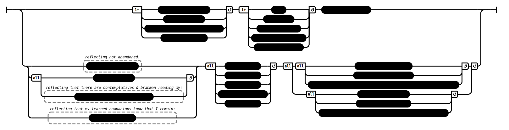

# Governing Principles (AN 3:40)

## Causation Model(s)

### Quote(s):
> There are these three governing principles. Which three? 
> 1. The self as a governing principle, 
> 2. the cosmos as a governing principle, and 
> 3. the Dhamma as a governing principle
> ---
> 1. If I were to seek the same sort of sensual pleasures that I abandoned in going forth from home into homelessness—or a worse sort—that would not be fitting for me. 
>    * So he reflects on this: My persistence will be aroused & not lax; my mindfulness established & not confused; my body calm & not aroused; my mind centered & unified. 
>       * Having made himself his governing principle, he abandons what is unskillful, develops what is skillful, abandons what is blameworthy, develops what is unblameworthy, and looks after himself in a pure way. This is called the self as a governing principle
> 2. If I, having gone forth, were to think thoughts of sensuality, thoughts of ill will, or thoughts of harmfulness: Great is the community of this cosmos, and in the great community of this cosmos there are contemplatives & brahmans endowed with psychic power, clairvoyant, skilled (in reading) the minds of others. They can see even from afar. Even up close, they are invisible. With their awareness they know the minds of others. They would know this of me: "Look, my friends, at this clansman who—though he has in good faith gone forth from the home life into homelessness—remains overcome with evil, unskillful mental qualities." There are also devas endowed with psychic power, clairvoyant, skilled (in reading) the minds of others. They can see even from afar. Even up close, they are invisible. With their awareness they know the minds of others. They would know this of me: "Look, my friends, at this clansman who—though he has in good faith gone forth from the home life into homelessness—remains overcome with evil, unskillful mental qualities." 
>     * So he reflects on this: My persistence will be aroused & not lax; my mindfulness established & not confused; my body calm & not aroused; my mind centered & unified. 
>       * Having made the cosmos his governing principle, he abandons what is unskillful, develops what is skillful, abandons what is blameworthy, develops what is unblameworthy, and looks after himself in a pure way. This is called the cosmos as a governing principle
> 3. The Dhamma is well taught by the Blessed One, to be seen here & now, timeless, inviting verification, pertinent, to be experienced by the observant for themselves. There are companions in the holy life who dwell knowing & seeing it. If I—having gone forth in this well-taught Dhamma & Vinaya—were to remain lazy & heedless, that would not be fitting for me. 
>     * So he reflects on this: My persistence will be aroused & not lax; my mindfulness established & not confused; my body calm & not aroused; my mind centered & unified. 
>       * Having made the Dhamma his governing principle, he abandons what is unskillful, develops what is skillful, abandons what is blameworthy, develops what is unblameworthy, and looks after himself in a pure way. This is called the Dhamma as a governing principle

Figure 1: Governing principles causation model

## Source
1. https://www.dhammatalks.org/suttas/AN/AN3_40.html