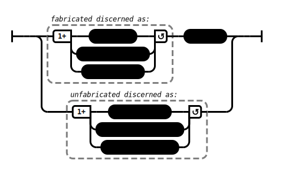

# Fabricated (AN 3:47–48)

## [_Speculative_] Causation Model(s)

### Quote(s):
> These three are fabricated characteristics of what is fabricated. Which three? 
>   1. Arising is discernable, 
>   2. Passing away is discernable, 
>   3. Alteration [literally: otherness] while staying is discernable
>
>  These three are unfabricated characteristics of what is unfabricated. Which three? 
>   1. No arising is discernable, 
>   2. No passing away is discernable, 
>   3. no alteration while staying is discernable

Figure 1: Fabricated causation model

## Source
1. https://www.dhammatalks.org/suttas/AN/AN3_47.html