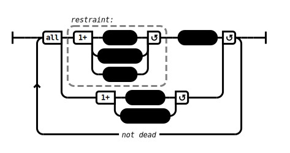

# Two People (1) (AN 3:52)

## Causation Model(s)

### Quote(s):
> This world is swept away 
> * by aging, 
> * by illness, 
> * by death. 
>
> With the world thus swept away by aging, illness, & death, any restraint of 
>   1. body, 
>   2. speech, & 
>   3. intellect 
>
> * practiced here will be one’s shelter, cave, island, & refuge after death in the world beyond

Figure 1: Restraint causation model

## Source
1. https://www.dhammatalks.org/suttas/AN/AN3_52.html