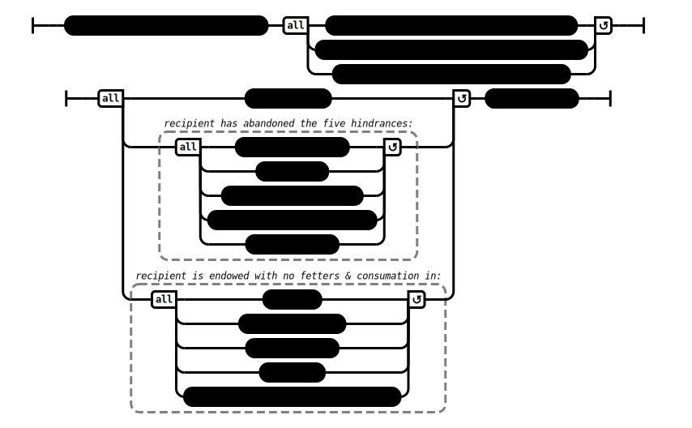

# To Vaccha (on Giving) (AN 3:58)

## Causation Model(s)

### Quote(s):
> Whoever prevents another from giving a gift creates three obstructions, three impediments. Which three? 
> 1. He creates an obstruction to the merit of the giver, 
> 2. an obstruction to the recipient’s gains, 
> 3. and prior to that he undermines and harms his own self
>
> But I do say that what is given to a virtuous person is of great fruit, and not so much what is given to an unvirtuous person. And the virtuous person has abandoned five factors and is endowed with five.
>
> * Which five has he abandoned? 
>   1. He has abandoned sensual desire… 
>   2. ill will… 
>   3. sloth & drowsiness… 
>   4. restlessness & anxiety… 
>   5. uncertainty. 
> 
> * And with which five is he endowed? 
>   1. He is endowed with the aggregate of virtue of one beyond training… 
>   2. the aggregate of concentration of one beyond training… 
>   3. the aggregate of discernment of one beyond training… 
>   4. the aggregate of release of one beyond training… 
>   5. the aggregate of knowledge & vision of release of one beyond training. 
>
> * I tell you: What is given to one who has abandoned these five factors and is endowed with these five, bears great fruit

Figure 1: Giving causation model

## Source
1. https://www.dhammatalks.org/suttas/AN/AN3_58.html