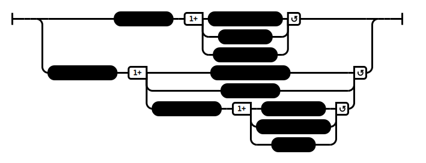

# To Sangarava (AN 3:61)

## Causation Model(s)

### Quote(s):
> **Sangarava:**
>
> We brahmans perform sacrifices and get others to perform sacrifices. 
>   * And whoever performs a sacrifice, whoever gets others to perform a sacrifice, they have all practiced a practice of merit—
>     * the business of a sacrifice—(that benefits) countless beings. 
>   * But whoever, leaving his family, has gone forth from the home life into homelessness, and tames his single self, brings his single self into tune, brings his single self to unbinding: his practice of merit—
>     * this business of going forth—is one (that benefits) only one being.
>
> **Buddha:**
>
> The Teacher teaches the Dhamma, and others practice, for authenticity [tathatta].
>   * And there are countless hundreds of them, countless thousands of them, countless hundreds of thousands of them. This being the case, is this practice of merit—
>     * this business of going-forth—one that benefits countless beings, or only one being?
> 
> **Ven. Ananda:**
>
> Of these two practices, brahman, which appeals to you as the less complicated, the less violent, the more fruitful, & the more rewarding?
>
> **Sangarava:**
>   * “This being the case, Master Gotama, this practice of merit—
>     * this business of going-forth—is one that benefits countless beings.
>
> **Buddha:**
>
> There are these three miracles. Which three? 
>   1. The miracle of psychic power, 
>   2. the miracle of telepathy, & 
>   3. the miracle of instruction
>
> **Sangarava:**
>
> As for the miracle where a certain person gives instruction in this way: 
>   1. Direct your thought in this way, don't direct it in that. 
>   2. Attend to things in this way, don't attend to them in that. 
>   3. Let go of this, enter and remain in that': 
>   * this is the miracle that, of the three, appeals to me as the highest & most sublime
>
> **Buddha:**
>
> There are not only one hundred other monks… two… three… four… five hundred other monks: The monks who are endowed with these three miracles are many more than that.

Figure 1: Instruction causation model

## Source
1. https://www.dhammatalks.org/suttas/AN/AN3_61.html